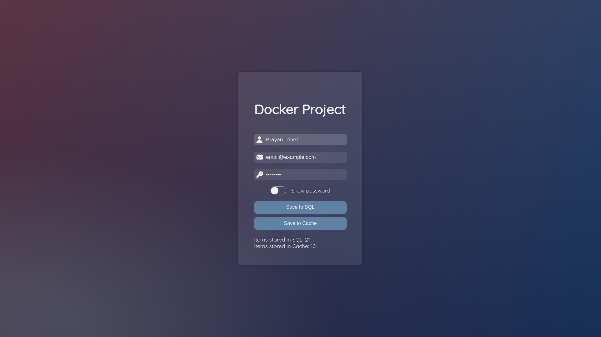
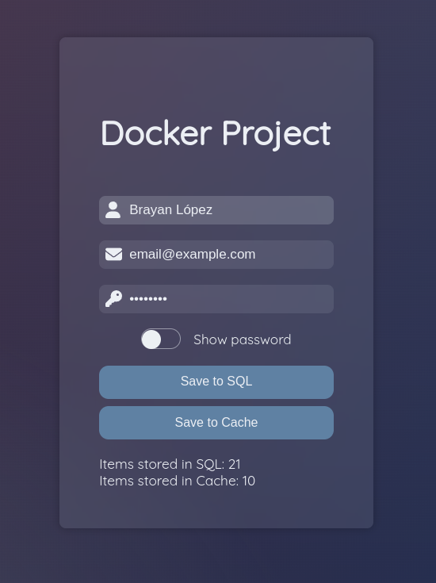
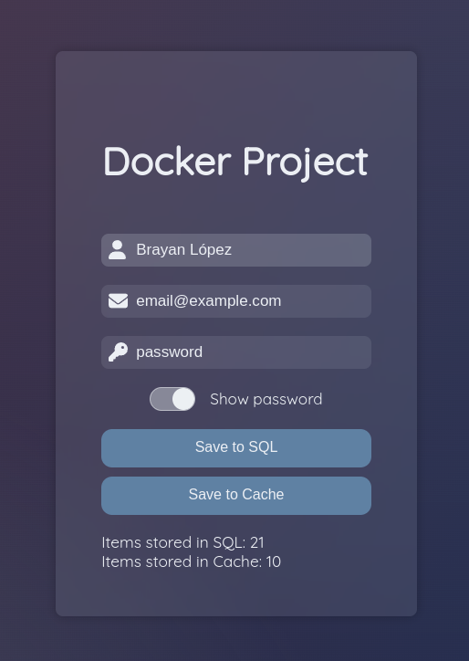
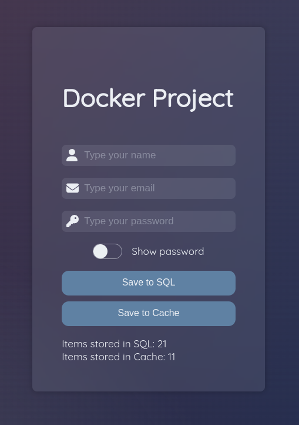

# NCLOUDS | Docker + Docker Compose

This project is the final project for Docker class taught by [nClouds Academy](https://www.nclouds.com/).

Tech Stack used in this project:

- [Golang 1.18](https://go.dev)
- [PostgreSQL 14.2](https://www.postgresql.org)
- [Docker 20.10.16](https://www.docker.com/get-started)
- [Docker Compose 2.5.0](https://docs.docker.com/compose/)
- [Ubuntu](https://ubuntu.com/)

> _Note: `make` commands should be executed from project's root directory_

Links to Docker Hub

- [React App](https://hub.docker.com/r/brxyxn/react-nclouds-app)
- [Golang App](https://hub.docker.com/r/brxyxn/go-nclouds-app)

## Preview



## Clone

### GitHub Repository

```sh
git clone git@github.com:brxyxn/nclouds-docker-final-project.git
cd nclouds-docker-final-project
```

### Docker Hub Repository

```sh
docker pull brxyxn/react-nclouds-app
docker pull brxyxn/go-nclouds-app
```

## Docker Swarm

Initialize docker swarm

```sh
docker swarm init
```

In case you have multiple network ids, please specify the `--advertise-addr` flag.

```sh
docker swarm init --advertise-addr # format: <ip|interface>[:port]
```

## Docker Secrets

Create your secrets file and specify a secret password, see example:

```sh
echo "secret_password" > pg_secrets.txt
```

`pg_secrets.txt`

```txt
secret_password
```

## Execute

```sh
docker-compose up --build
# or
docker compose up --build
# or
make docker-up
```

If you want to start the containers with no output first do `build` and then `start`

```sh
docker-compose build
docker-compose start
# or
make docker-build
make docker-start
```

## Open

Open your browser and enter to [localhost:3000](http://localhost:3000/)

### Screenshots

> Password Component Show Password Off



> Password Component Show Password On



> Item Saved to Cache



## Database

### Configuration

Make sure the database is created when running `docker-compose up` the first time by reading the output. By default the file is included and mounted to the database and it should be setup automatically, if any error ocurrs you can create the database with the following script.

`database/setup.sql`

```sql
-- CREATE DATABASE nclouds_db;
/**/;
CREATE TABLE IF NOT EXISTS users (
    user_id INT NOT NULL GENERATED ALWAYS AS IDENTITY,
    username VARCHAR(50) NOT NULL,
    email VARCHAR(50) NOT NULL,
    password VARCHAR(50) NOT NULL,

    CONSTRAINT client_pk PRIMARY KEY (user_id)
);
```

### Migrations (Optional)

You need to [install liquibase](https://docs.liquibase.com/install/home.html) before continuing.

Update `username` and `password` values in file `backend/migrations/liquibase.properties` based on `DC_PG_USER` and `pg_secret.txt` values.

```properties
# ...
username: nclouds_user
password: secret
# ...
```

Inside the `migrations` directory use liquibase to run migrations

```sh
cd /backend/migrations
liquibase --defaultsFile=liquibase.properties --changeLogFile=changelog.xml update
# or
make db_migrate
```

Optionally you can validate migrations with `validate`

```sh
cd /backend/migrations
liquibase --defaultsFile=liquibase.properties --changeLogFile=changelog.xml validate
# or
make db_validate
```
